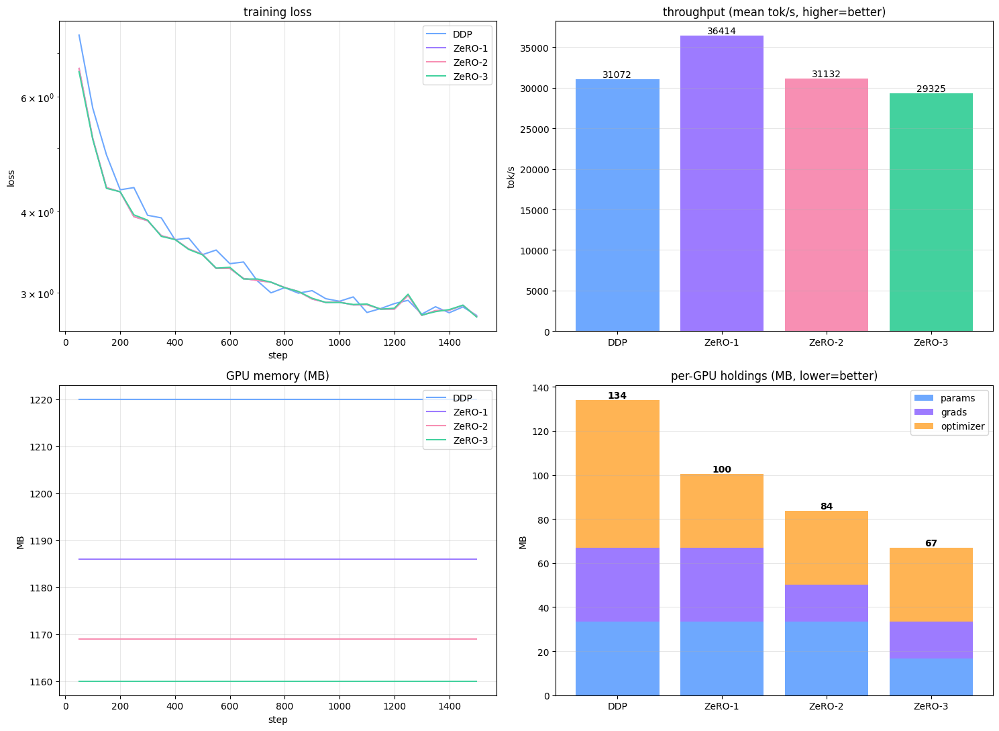

# Session 12 — DDP vs ZeRO-1 / ZeRO-2 / ZeRO-3

Same model, same data, four ways of splitting the work across GPUs. The question: **what does each GPU have to keep in memory, and what does it cost?**

**Hardware:** Kaggle, 2× Tesla T4 (15.6 GB each), launched with `torchrun --nproc_per_node=2`.

## The problem in one picture

To train a model with Adam, each GPU needs three things for every parameter:

```
  weights      4 bytes   ->  to run forward and backward
  gradients    4 bytes   ->  to know which way to move each weight
  Adam m + v   8 bytes   ->  Adam's running averages, to decide how far to move
  ------------------------
  total       16 bytes per parameter
```

With **DDP**, every GPU keeps **all 16 bytes for every parameter**. Two GPUs means two identical copies of everything. That's wasteful: the GPUs end up with the same numbers anyway.

**ZeRO** ("Zero Redundancy") removes the duplicates one piece at a time. Each GPU keeps only **its half** (1/N for N GPUs) and asks the other GPU for the rest only when it's needed.

## Who holds what (2 GPUs)

`█` = full copy, `▌` = only this GPU's half

```
                 weights   gradients   Adam m+v      per GPU
DDP     GPU 0      █          █           ██          16 B/param
        GPU 1      █          █           ██          16 B/param

ZeRO-1  GPU 0      █          █           ▌           12 B/param   <- split the optimizer
        GPU 1      █          █           ▌

ZeRO-2  GPU 0      █          ▌           ▌           10 B/param   <- + split the gradients
        GPU 1      █          ▌           ▌

ZeRO-3  GPU 0      ▌          ▌           ▌            8 B/param   <- + split the weights
        GPU 1      ▌          ▌           ▌
```

**How each step works:**
- **ZeRO-1: split the optimizer.** Each GPU *owns* half the parameters and runs Adam only for those, so it needs Adam's m and v only for its half. After updating, each GPU sends its fresh weights to the other.
- **ZeRO-2: split the gradients too.** If GPU 0 only updates its half, it only needs gradients for that half. Each gradient is summed onto its owner, and the other GPU throws its copy away.
- **ZeRO-3: split the weights too.** Each GPU stores only half the weights. Just before a layer runs, the GPUs swap halves so both have the full layer; right after, they drop the other half again. This happens in forward and again in backward.

**The trade-off:** each stage saves memory, but ZeRO-3 has to fetch weights all the time, so it communicates the most.

## Setup

| | |
|---|---|
| Model | GPT, **8.38M params** · 6 layers · width 256 · 8 heads · context 128 · vocab 4,002 |
| Data | TinyStories, byte-level BPE tokenizer · 40.9M train / 5.6M val tokens |
| Batch | 32 sequences per GPU × 128 tokens × 2 GPUs = **8,192 tokens / step** |
| Run | **1,500 steps** = 12.3M tokens |
| Optimizer | AdamW, peak LR 3e-4, cosine decay; warmup 100 steps (DDP: 200) |

## Results



| | DDP | ZeRO-1 | ZeRO-2 | ZeRO-3 |
|---|---|---|---|---|
| Weights / GPU | 33.5 MB | 33.5 MB | 33.5 MB | **16.8 MB** |
| Gradients / GPU | 33.5 MB | 33.5 MB | **16.7 MB** | **16.8 MB** |
| Adam m+v / GPU | 67.0 MB | **33.4 MB** | **33.4 MB** | **33.5 MB** |
| **Total / GPU** | **134 MB** | **100 MB** | **84 MB** | **67 MB** |
| Bytes per param | 16 | 12 | 10 | 8 |
| Saved vs DDP | — | 25% | 37% | **50%** |
| Peak GPU memory | 1,220 MB | 1,186 MB | 1,169 MB | 1,160 MB |
| Speed (tok/s) | 31,072 | 36,414 | 31,132 | 29,325 |
| Final train loss | 2.769 | 2.759 | 2.759 | 2.754 |

*The totals are measured, not computed: after training, each GPU added up the bytes of the tensors it actually held. Both GPUs reported the same numbers.*

## What the results say

**1. Memory comes out exactly as predicted.**
134 → 100 → 84 → 67 MB is 16 → 12 → 10 → 8 bytes per parameter. Each stage removes the copy it says it removes.

**2. Splitting the optimizer gives the biggest single win.**
Adam's m and v are half of everything (8 of 16 bytes), so ZeRO-1 alone saves 25%.

**3. But peak memory hardly moves (1,220 → 1,160 MB). Why?**
The model states (weights + gradients + Adam) are only 6–11% of the peak. The rest is **activations**: the values each layer saves during forward so backward can use them. ZeRO doesn't touch activations.

```
peak 1,220 MB (DDP)   [■■■■■■■■■■■■■■■■■■■■■■■■■■■■■■■■■■■■■■■■■■■■■■■■■■■■■■] 
                       ↑ model states 134 MB (11%)    activations + buffers (~89%)
```

For an 8M-param model, ZeRO is solving a small problem. It matters when the model itself is huge: a 7B model needs 7B × 16 B = 112 GB just for model states, which no single GPU has. With ZeRO-3 on 32 GPUs, that's 3.5 GB each.

**4. Splitting doesn't change the learning.**
ZeRO-1 and ZeRO-2 give **identical** losses at every step: same maths, different storage. ZeRO-3 is a hair off only because its script initialises the model differently (on the `meta` device), and DDP's curve differs because it used a 200-step warmup instead of 100. All four end at ~2.76.

**5. ZeRO-3 pays for its savings in communication.**
It's the slowest (29.3k tok/s), because every layer's weights are gathered twice per step. The other speed differences are noise: tok/s is sampled from single steps and swings by thousands, so "ZeRO-1 is fastest" isn't a real result.

## Why 2 real GPUs instead of 32 virtual ones

The assignment suggests 32 *virtual* GPUs (CPU threads pretending to be devices). I used **2 real GPUs**:

- **The communication is real.** Every gradient sum, weight broadcast and weight gather actually travels between two physical GPUs over NCCL.
- **The memory is real.** Each GPU is a separate device, so "what does GPU 0 hold?" is measured, not simulated.
- **32 is just a launch flag.** No script assumes 2: each one reads the number of GPUs (N) at runtime and splits by it.

```
torchrun --nproc_per_node=2  zero3_launch.py                    # this run: 1 machine x 2 GPUs
torchrun --nnodes=4 --nproc_per_node=8 ... zero3_launch.py      # 4 machines x 8 = 32 GPUs
```

With the same formulas and this model's 8.38M params, here's what each GPU would hold:

| GPUs | DDP | ZeRO-1 | ZeRO-2 | ZeRO-3 |
|---|---|---|---|---|
| 1 | 134 MB | 134 MB | 134 MB | 134 MB |
| **2** *(measured)* | 134 MB | 100 MB | 84 MB | 67 MB |
| 8 | 134 MB | 75 MB | 46 MB | 17 MB |
| 32 | 134 MB | 69 MB | 37 MB | **4 MB** |

- **DDP never gets better:** each new GPU brings another full copy.
- **ZeRO-1 and ZeRO-2 level off** at the part they don't split (weights + gradients for ZeRO-1, weights for ZeRO-2).
- **Only ZeRO-3 keeps shrinking.** That's what makes models much bigger than one GPU trainable.

## How the code does it

Each GPU runs one copy of the script (one *rank*). The trainers differ only in what they keep and what they send:

| Mode | Script | Each step |
|---|---|---|
| DDP | `ddp_launch.py` | Sum every gradient across GPUs (`all_reduce`), average, and every GPU runs Adam on everything |
| ZeRO-1 | `zero1_launch.py` | Parameters dealt out in turn (`owner = i % N`). Gradients still summed everywhere; each GPU runs Adam only on its own params, then `broadcast`s the new weights |
| ZeRO-2 | `zero2_launch.py` | Each gradient is summed **only onto its owner** (`reduce`); the other GPU drops it (`p.grad = None`). The owner updates and broadcasts |
| ZeRO-3 | `zero3_launch.py` | PyTorch FSDP (`FULL_SHARD`), one unit per transformer block: gather a block's weights, run it, free them |

**Simplifications compared with production ZeRO (DeepSpeed / FSDP):**
- ZeRO-1/2 split **by whole parameter**, so the halves are only roughly equal (33.38 vs 33.51 MB).
- ZeRO-2 drops the unneeded gradients *after* backward; real ZeRO-2 does it *during* backward, so the full set never exists at once.

## My notes

<!-- 3–5 lines in your own words -->

## Files

```
ddp-zero1-2-3-train.ipynb   the notebook that ran on Kaggle (all cells + outputs)
inputs/                     dependencies (Kaggle dataset gona26/tinystories-slm)
  data_pipeline.py          tokenizer, config, token shards -> batches
  learn_pipeline.py         GPT model, masks, loss, LR schedule
  prep_data.py              one-time: raw TinyStories -> tokenizer + shards
  plot.py                   metrics CSV -> plots
  bpe/                      trained tokenizer (vocab.json, merges.txt)
results/                    outputs of the run
  *_launch.py               the trainers (written by the notebook)
  metrics*.csv              loss, tok/s, LR, memory every 50 steps
  holdings*.csv             weights / gradients / optimizer MB per GPU
  __results___files/        comparison plots
```

The token shards aren't in the repo. To rerun: on Kaggle, choose *GPU T4 ×2*, add the dataset `gona26/tinystories-slm`, and *Run all*.

## References

- Rajbhandari et al., *ZeRO: Memory Optimizations Toward Training Trillion Parameter Models*, SC 2020
- Zhao et al., *PyTorch FSDP: Experiences on Scaling Fully Sharded Data Parallel*, VLDB 2023
