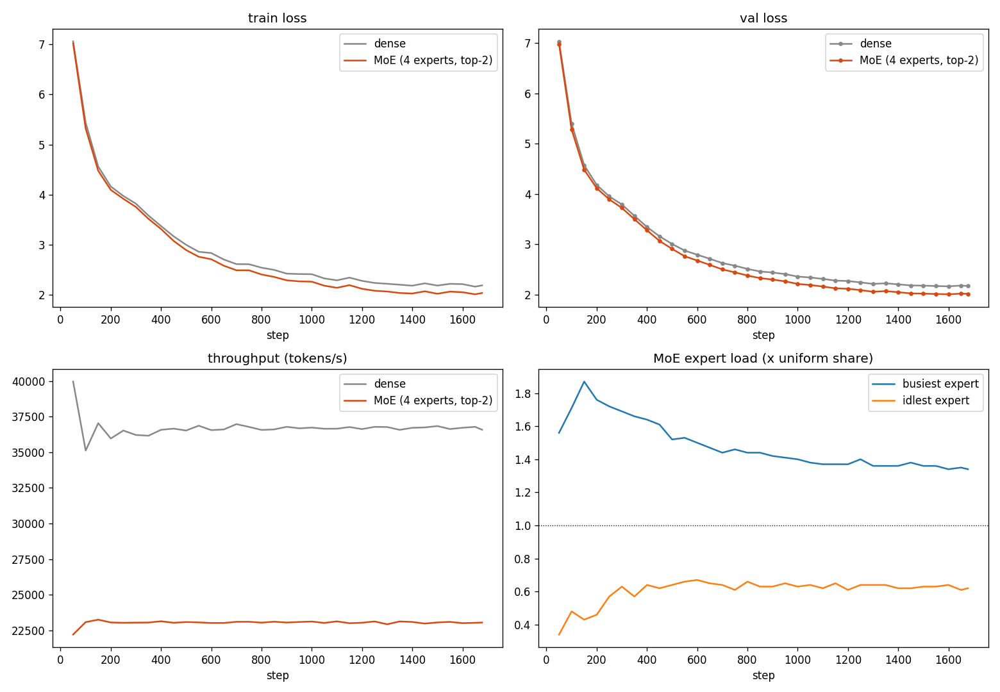

# Session 14 — Dense vs Mixture-of-Experts

Train the same ~20M GPT twice from scratch with ZeRO-3: once **dense**, once with every FFN replaced by a **Mixture-of-Experts** layer. Everything else (data, batch, steps, LR schedule and seed) is identical, so the only difference between the two runs is the architecture. The goal is to show the MoE trains and reduces loss, and to compare it with the dense model.

**Hardware:** Kaggle, 2× Tesla T4, `torchrun --nproc_per_node=2`. **Data:** TinyStories, the same shards and tokenizer as session 13.

## Scripts

| File | What it is |
|---|---|
| `scripts/transformer.py` | **dense** model (`GPT`, `Block`, `SwiGLU`), same as session 13 |
| `scripts/moe_pipeline.py` | **MoE** model (`MoE`, `MoEBlock`, `MoEGPT`), which reuses attention, norms and SwiGLU from `transformer.py` |
| `scripts/zero3_launch.py` | trains the **dense** model (session 13's launcher, batch set to 64) |
| `scripts/moe_launch.py` | trains the **MoE** model: a copy of `zero3_launch.py`, with every change marked `# MoE` |
| `scripts/data_pipeline.py` | data streams, same as session 13 |
| `scripts/plot_moe.py` | dense vs MoE plots from the two metrics CSVs |

## What changes from dense to MoE

**In the model** (`moe_pipeline.py`), one line per block:

```python
self.ffn = SwiGLU(c)          # dense: every token -> the same 1 FFN
self.ffn = MoE(c, E=4, k=2)   # MoE: 4 SwiGLU experts + router; each token -> its top-2
```

| | Dense | MoE |
|---|---|---|
| FFN per block | 1 SwiGLU (384 → 1536 → 384) | 4 SwiGLU experts |
| Router | — | `Linear(384 → 4)` + softmax, top-2, weights renormalised to sum to 1 |
| Total params | ~19.7M | ~56.9M |
| Active params per token | ~19.7M | ~32.1M |

The MoE layers use:

- **Dropless routing.** There's no capacity limit, so no token is ever dropped. Every expert runs on every step, even with 0 tokens, so FSDP always gets a gradient for it.
- **Load-balancing loss.** This is the Switch-style `E · Σ f_e · P_e`, weighted 0.01. It equals 1.0 when routing is perfectly balanced, and it stops the router sending every token to one expert.

**In the launcher** (`diff scripts/zero3_launch.py scripts/moe_launch.py` shows every change):

| Change | Dense | MoE |
|---|---|---|
| Model | `GPT(cfg)` | `MoEGPT(cfg, 4, 2)` |
| ZeRO-3 shard unit | `Block` | `MoEBlock` |
| Loss | `loss` | `loss + 0.01 * aux_loss` |
| Logged extras | — | `aux_loss`, `load_min`, `load_max` |
| Output files | `*_zero3_<id>` | `*_moe_<id>` |

## Run

```bash
torchrun --nproc_per_node=2 scripts/zero3_launch.py   # dense
torchrun --nproc_per_node=2 scripts/moe_launch.py     # MoE
python scripts/plot_moe.py metrics_zero3_<id>.csv metrics_moe_<id>.csv plots/
```

Keep all the scripts in one folder. The token shards load from the Kaggle dataset. `data_pipeline.py` looks for the tokenizer at `data/bpe` under the working directory, so link it once before launching (same as session 13):

```python
import os
os.makedirs("/kaggle/working/data", exist_ok=True)
if not os.path.exists("/kaggle/working/data/bpe"):
    os.symlink("/kaggle/input/datasets/gona26/tinystories-data-540m/bpe", "/kaggle/working/data/bpe")
```

## Settings (identical in both runs)

| Setting | Value |
|---|---|
| Model | L=7, D=384, H=8, T=256, V=4,002 |
| Data | 55M train tokens, one pass, seed 1234 |
| Batch | 64 per GPU × 2 = 128 sequences (32,768 tokens/step) |
| Steps | 1,678 |
| LR | 3e-4 peak, 300-step warmup, cosine to 0.1× |
| Init seed | `torch.manual_seed(0)` |
| Eval | 20 val batches every 50 steps |

The batch is 64, not session 13's max of 120, because top-2 routing runs two FFNs per token. That roughly doubles FFN activations, so the MoE would run out of memory at 120. The dense run uses 64 too so the two match. Session 13 also has a dense B=64 run to cross-check against (final val loss 2.172).

## Results



| | Dense | MoE |
|---|---|---|
| Total / active params | 19.7M / 19.7M | 56.9M / 32.1M |
| **Final train loss** | 2.184 | **2.033** |
| **Final val loss** | 2.172 | **2.016** |
| Final val perplexity | 8.77 | **7.51** |
| Speed (tokens/s, both GPUs) | **~36,600** | ~23,000 |
| Training time (55M tokens) | **~25 min** | ~40 min |
| Peak memory / GPU | **7.5 GB** | 11.8 GB |
| Model states / GPU (weights + grads + Adam) | **158 MB** | 455 MB |
| Expert load min / max (× uniform) | — | 0.62 / 1.34 |

Val loss along the way:

| Step | 500 | 1000 | 1678 (end) |
|---|---|---|---|
| Dense | 3.007 | 2.359 | 2.172 |
| MoE | **2.909** | **2.213** | **2.016** |

## What the results say

**1. The MoE trains and keeps reducing loss.** Val loss falls steadily from 6.98 to 2.016 over the whole run, with no spikes or plateaus. It's below the dense model at every eval, and the gap grows from 0.05 at step 50 to 0.16 at the end.

**2. The router stays balanced.** The balancing loss ends at 1.035, where 1.0 is perfect. No expert dies: the idlest gets 0.62× an even share and the busiest 1.34×. Early on, routing was lopsided (0.34 / 1.87 at step 50–150). The balancing loss pulled it back within the first ~500 steps.

**3. Better per step, not per second.** The MoE reaches the dense model's final val loss (2.172) at about step 1,100, so it needs about 35% fewer steps. But each step is about 1.6× slower, because every token runs through 2 FFNs. In wall time that's roughly a tie (~26 min vs ~25 min). The MoE pays for its gain with 3× the weights and about 1.6× the peak memory.
